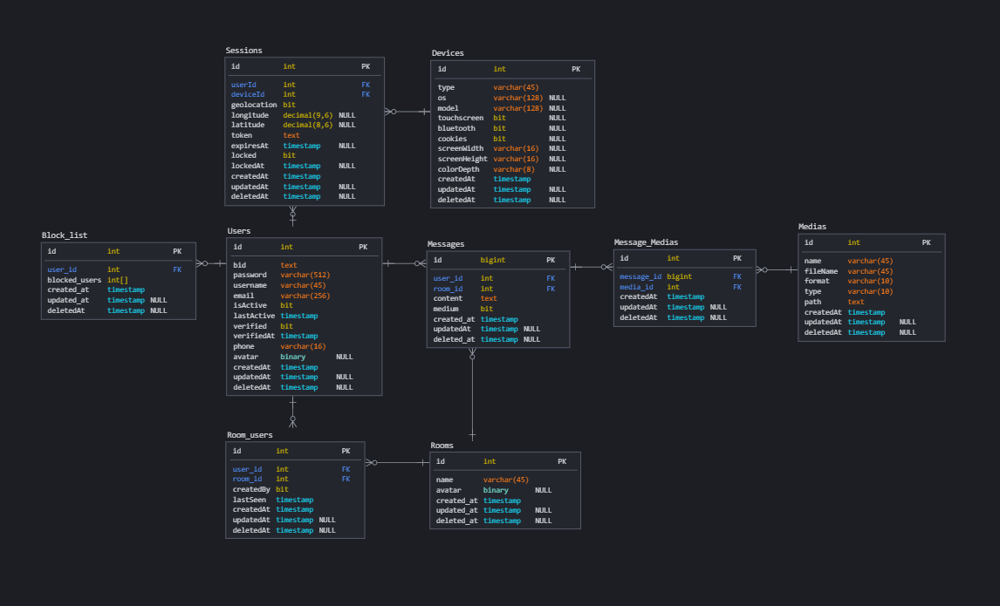

Github: https://github.com/SkakalaJ/MTAA-Project

# Messenger Backend
Before running docker-compose file run command in docker:
```
docker network create external-network
```
Buildable and startable through docker-compose (-d option signs detach mode):
```
docker-compose up --build -d
```
Some logs in running container can be seen with docker cmd:
```
docker logs messenger-api -f
```
### Migrations
For generating new empty TS migration file use:
```
npm run migrations:generate -- -n "Name of new migration"
```
This will create new empty migration file in directory `/src/migrations`

Before running any migration, you have to compile migrations using command:
```
npm run migrations:compile
```

Once all migrations files has been successfully built, use this command to apply migrations:
```
npm run migrations:run
```

If you need to revert applied migration for some reason, use command:
```
npm run migrations:revert
```
### Services and Requirements
#### pgAdmin version 4
Exposed on port: 5050
container name: messenger-pgadmin4
login name: admin@admin.sk
password: postgres
#### Postgres 11
Exposed on port: 5432
container name: messenger-postgres
name: postgres
password: postgres
#### API
Exposed on port: 4000
container name: messenger-api

## Implemented Endpoints
Base url:
```
http://localhost:4000/
```
- those endpoints which requires Bearer token in authentification needs to have valid non expired token.
- Token can be retrieved through login. If you don't know login credentials it's possible to create new user through registration and retrieve token through new registered user.

### Endpoints:
#### Login
```
POST http://localhost:4000/api/users/login
```
Minimal request body example:
```
{
    "username": "JurajSkakala",
    "password": "JS_FIIT",
    "geolocation": false,
    "device": {
        "type": "mobile phone"
    }
}
```
Response body example:
```
{
    "data": {
        "userBid": "USR00000002",
        "username": "JurajSkakala",
        "accessToken": "61c45f88-202f-4cca-89f1-0107e5aa594f"
    },
    "error": null
}
```
#### Register
```
POST http://localhost:4000/api/users/register
```
Minimal request body example:
```
{
    "username":"Test register",
    "password":"Pas`'{}/.?,[]sword1",
    "email":"user@user.sk",
    "phone":null
}
```
Response body example:
```
{
    "data": {
        "userBid": "USR00000003",
        "username": "TestUserUlala",
        "email": "user@user.sk",
        "phone": null,
        "verified": true,
        "avatar": null
    },
    "error": null
}
```
#### Logout
```
POST http://localhost:4000/api/users/logout
```
- Valid Bearer Token required
Minimal request body example:
```
{
    "userBid":"USR00000002",
    "device": {
        "type": "mobile phone"
    }
}
```
Response body example:
```
{
    "data": "User logged out.",
    "error": null
}
```
#### Find User
```
GET http://localhost:4000/api/users/:userId
```
- Valid Bearer Token required
Minimal request body example:
```
{
    "username":"Test register",
    "password":"Pas`'{}/.?,[]sword1",
    "email":"user@user.sk",
    "phone":null
}
```
Response body example:
```
{
    "data": {
        "userBid": "USR00000003",
        "username": "TestUserUlala",
        "email": "user@user.sk",
        "phone": null,
        "verified": true,
        "avatar": null
    },
    "error": null
}
```
#### Message Delete
```
DELETE http://localhost:4000/api/rooms/:roomId/messages/:messageId
```
- Valid Bearer Token required
Response body example:
```
{
    "data": {
        "id": "30",
        "roomId": 1,
        "medium": true,
        "medias": [
            {
                "id": "12",
                "name": "test_name",
                "fileName": "file_name",
                "type": "video",
                "format": ".mp4",
                "url": "url.sk/xxx"
            },
            {
                "id": "13",
                "name": "test_name",
                "fileName": "file_name",
                "type": "video",
                "format": ".mp4",
                "url": "url.sk/xxx"
            }
        ]
    },
    "error": null
}
```
#### Message Get
```
GET http://localhost:4000/api/rooms/:roomId/messages/?offset=5
```
- Valid Bearer Token required
Response body example:
```
{
    "data": {
        "roomId": 1,
        "itemCount": 25,
        "items": [
            {
                "userId": 2,
                "content": "",
                "createdAt": "2021-04-01T16:26:14.770Z",
                "medium": true,
                "medias": [
                    {
                        "id": "4",
                        "name": "test_name",
                        "fileName": "file_name",
                        "type": "video",
                        "format": ".mp4",
                        "url": "url.sk/xxx"
                    },
                    {
                        "id": "5",
                        "name": "test_name",
                        "fileName": "file_name",
                        "type": "video",
                        "format": ".mp4",
                        "url": "url.sk/xxx"
                    }
                ]
            },
            {
                "userId": 2,
                "content": "",
                "createdAt": "2021-04-01T15:45:24.958Z",
                "medium": true,
                "medias": []
            },
            {
                "userId": 2,
                "content": "",
                "createdAt": "2021-04-01T15:25:28.208Z",
                "medium": true,
                "medias": [
                    {
                        "id": "2",
                        "name": "test_name",
                        "fileName": "file_name",
                        "type": "picture",
                        "format": ".mov",
                        "url": "url.sk/xxx"
                    },
                    {
                        "id": "3",
                        "name": "test_name",
                        "fileName": "file_name",
                        "type": "picture",
                        "format": ".mov",
                        "url": "url.sk/xxx"
                    }
                ]
            }
        ]
    },
    "error": null
}
```
#### Message Post
```
POST http://localhost:4000/api/rooms/:roomId/messages/
```
- Valid Bearer Token required
Request body example:
```
{
    "content":"AAAAAAA",
    "medium":true,
    "medias": [
        {
            "name":"test_name",
            "fileName":"file_name2",
            "format":".mp4",
            "type":"video",
            "path":null,
            "url":"url.sk/xxx"
        },
        {
            "name":"test_name",
            "fileName":"file_name",
            "format":".mp4",
            "type":"video",
            "path":null,
            "url":"url.sk/yyy"
        }
    ]
}
```
Response body example:
```
{
    "data": {
        "roomId": 1,
        "id": "34",
        "content": "",
        "createdAt": "2021-04-01T17:09:22.699Z",
        "sentBy": {
            "avatar": null,
            "bid": "USR00000002",
            "username": "JurajSkakala",
            "owner": true
        },
        "seenBy": [
            {
                "avatar": null,
                "bid": "USR00000002",
                "username": "JurajSkakala",
                "owner": true
            }
        ],
        "media": true,
        "medias": [
            {
                "id": "20",
                "name": "test_name",
                "fileName": "file_name2",
                "format": ".mp4",
                "type": "video",
                "url": "url.sk/xxx"
            },
            {
                "id": "21",
                "name": "test_name",
                "fileName": "file_name",
                "format": ".mp4",
                "type": "video",
                "url": "url.sk/yyy"
            }
        ]
    },
    "error": null
}
```
#### Room Create
```
POST http://localhost:4000/api/rooms/
```
- Valid Bearer Token required
Minimal request body example:
```
{
    "name":"new room"
}
```
Response body example:
```
{
    "data": {
        "name": "new room",
        "createdAt": "2021-04-01T21:24:09.045Z",
        "avatar": null
    },
    "error": null
}
```
#### Room Update
```
PUT http://localhost:4000/api/rooms/:roomId
```
- Valid Bearer Token required
Minimal request body example:
```
{
    "name":"new room"
}
```
Response body example:
```
{
    "data": {
        "name": "new room",
        "createdAt": "2021-04-01T15:09:19.171Z",
        "avatar": null
    },
    "error": null
}
```

### Database Model

